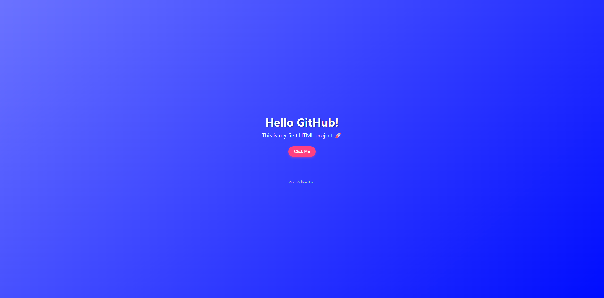

# 🌟 HTML First Site

Merhaba! 👋  
Bu proje, HTML ile geliştirdiğim **ilk kişisel web sayfam**dır.  
Modern tasarıma sahip, mobil uyumlu ve basit etkileşimler içeren bir web projesidir.


---

## 🖼️ Ekran Görüntüsü



---

## 🌐 Canlı Demo

🔗 [html-first-site’i görüntüle](https://ilkerkuru.github.io/html-first-site/)

---

## 🚀 Özellikler

- 📱 Responsive tasarım (mobil uyumlu)
- 🎨 Gradient arka plan ve modern fontlar
- 🖱️ Etkileşimli "Click Me" butonu (alert)
- 🔤 Temiz, sade ve öğrenmesi kolay kod yapısı

---

## 🛠️ Kullanılan Teknolojiler

| Teknoloji | Açıklama |
|-----------|----------|
| HTML5     | Sayfa yapısı |
| CSS3      | Görsel stil ve düzen |
| JavaScript (inline) | Buton işlevi |

---

## 🧪 Projeyi Çalıştırma

Bu projeyi kendi bilgisayarında test etmek için:

```bash
git clone https://github.com/ilkerkuru/html-first-site.git
cd html-first-site
start index.html   # Windows
# veya
open index.html    # macOS
